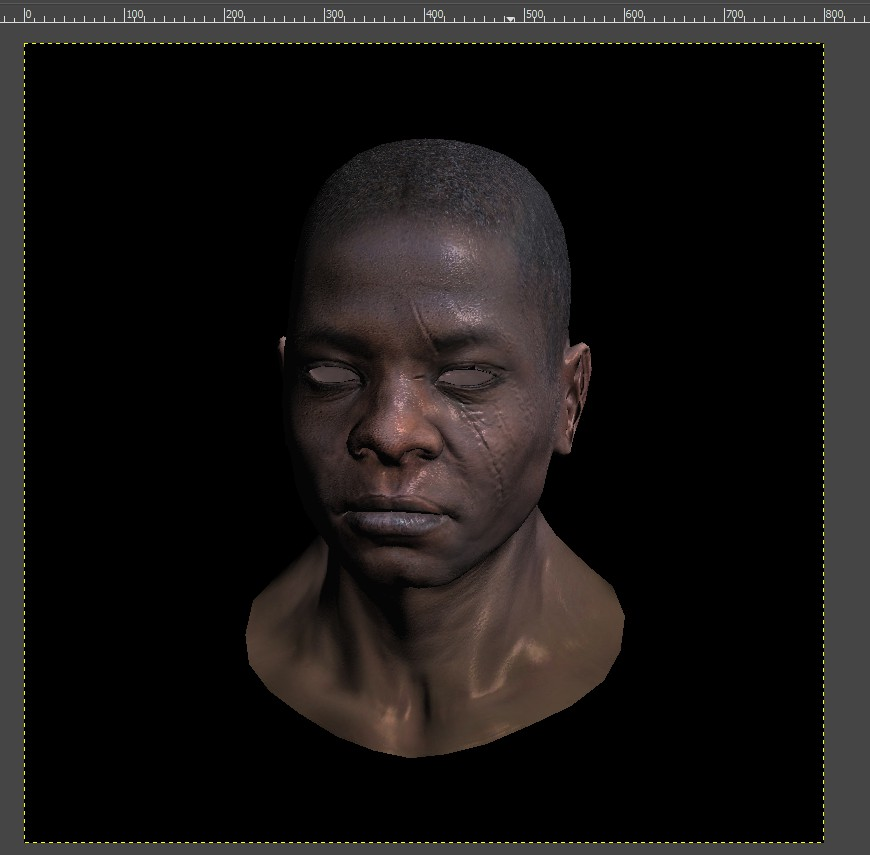
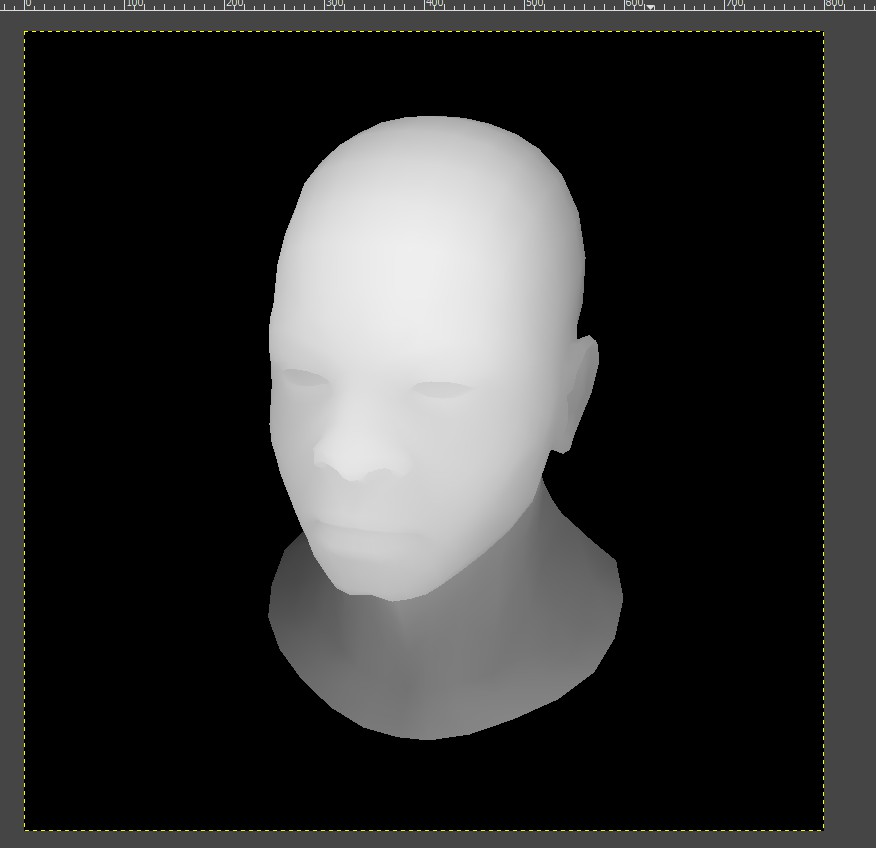

# CrunchyRender
一个简易的渲染引擎，主要来自ssloy大佬的[tinyrenderer](https://github.com/ssloy/tinyrenderer)

文件主要实现在main.cpp、gl.cpp和old.cpp，其他文件来自ssloy。

gl.cpp内容：

1. MVP矩阵
2. 重心坐标
3. 三角光栅化

main.cpp内容：

1. phong shader

old.cpp内容：

	1. Bresenham直线算法
 	2. 三角光栅化扫描线算法

效果展示：
1. shader

2. zbuffer

